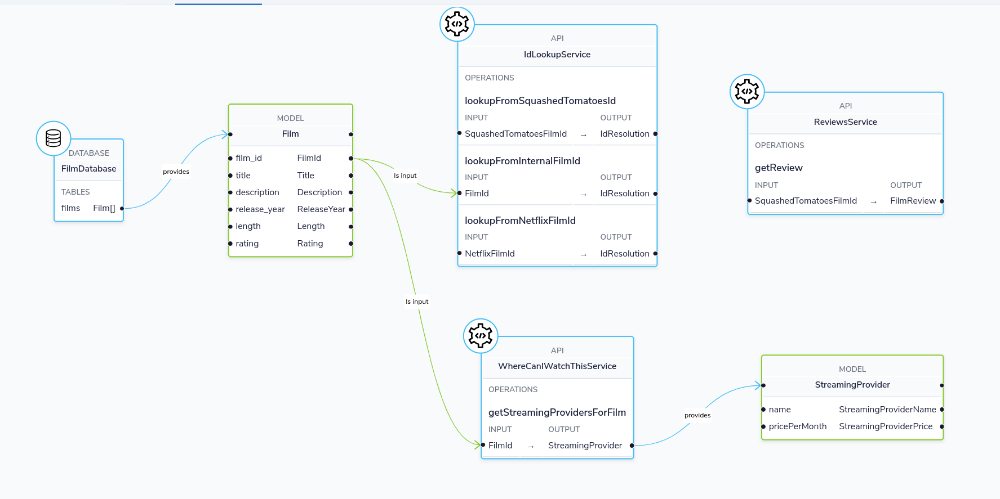
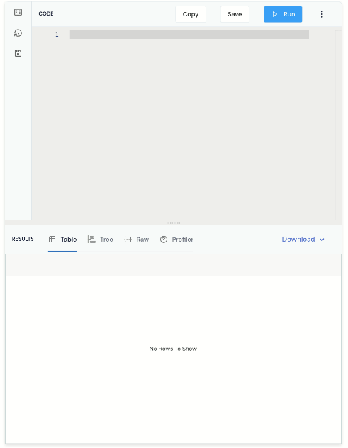
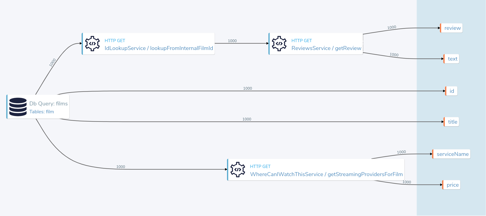
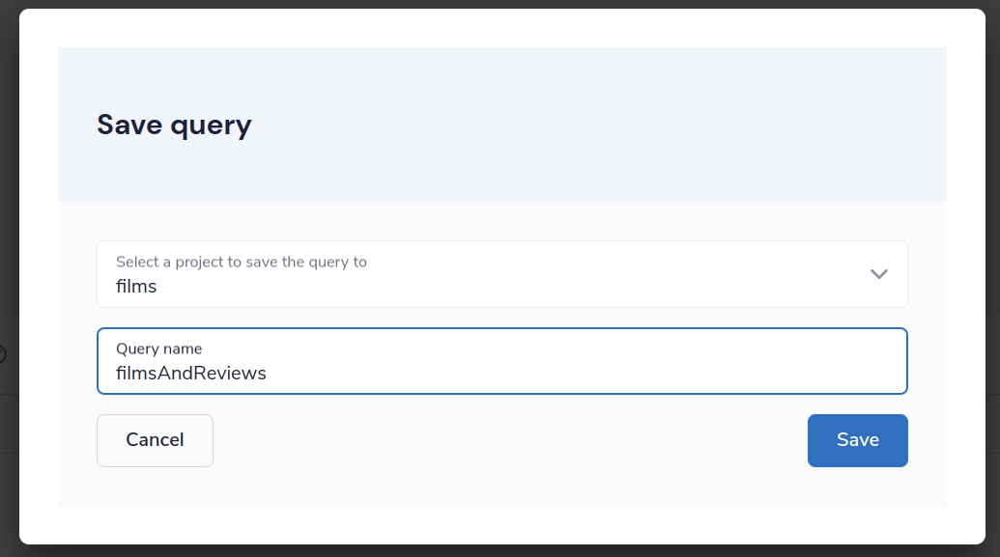
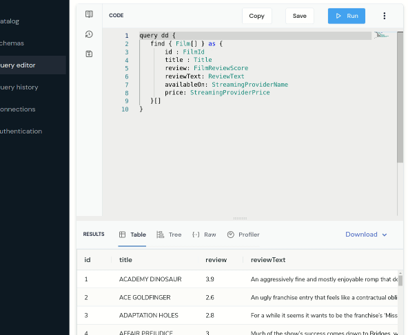

# Composing APIs and DBs - Spring Boot Edition

This demo focuses on stitching together APIs and a Database call, to create a custom API for our needs.  You'd typically use this in a Backend-for-frontend (BFF) pattern.

This demo takes place in a fictitious film studio called Petflix, where we'll stitch together data about our Films catalog, along with data from REST APIs, like the reviews of each film, and where we can watch it.

## Our demo services


This demo deploys the following:

 * A database exposing a catalog of Films
 * A Spring Boot service, containing:
   * A REST Endpoint that returns which streaming services are playing each film
   * A REST Endpoint that returns reviews for each film
   * A REST Endpoint that resolves ids.
     * Our services have different ID schemes - specifically the IDs used in our DB are not the same IDs used by our FilmReviews API. Therefore, we need to map one set of Ids to another.
  * The Spring Boot service generates and registers it's schema on startup.
    * Alternative approaches are using OpenAPI specs, annotated with Taxi types.
    * The corresponding OpenAPI specs are in [`./services/api-docs.yaml`](/services/api-docs.yaml)
    * An OpenAPI version of this demo will be posted shortly. 

## What the demo shows

 * ([Link](#composing-apis)) Building a TaxiQL for data sourced from the three different stores (Db, WatchingService, ReviewService) 
 * Resolving the different ID schemes
 * ([Link](#exposing-a-composite-api)) Exposing a REST API that returns our composed result set

## Exploring the components

### Taxi project
A [Taxi](https://taxilang.org) project is at `./taxi`

 * `films.taxi` defines a handful of semantic types, that we use in our API specs. eg:

```taxi
type FilmId inherits Int

[[ The name of a streaming service where people can watch a movie ]]
type StreamingProviderName inherits String
```

 * `FilmsDb.taxi` enriches the database schema, to add semantic types to the tables
 * `orbital/config/connections.conf` has details on how Orbital connects to the database

### Auto generated Kotlin Code
This demo converts our Taxi types into Kotlin, so that we can use them directly
in our Service definitions.

For example:

```kotlin
    @GetMapping("/reviews/{filmId}")
    @Operation
    fun getReview(@PathVariable("filmId") 
                  filmId: SquashedTomatoesFilmId // Note this is a semantic type, geneated from our Taxi type defs
    ): FilmReview {
```

This step is optional, but means we can generate our API specs directly from the code.

Normally, you'd build these in a CI/CD step using `taxi build`, but we've checked them in to
make everything a little clearer

### Spring Boot Services
Spring boot services are at `services`.

There's a single app, with 3 rest APIs exposed.


## Running this demo
Clone this repo, and cd into this directory

Run the following docker command to start Orbital, preconfigured with this project:

```bash
docker compose up -d
```

## Things to Try
After 20 seconds or so, open http://localhost:9022, and you should see Orbital's UI.

### Composing APIs
In the [Query Editor](http://localhost:9022/query/editor), write a query to ask for data coming from the 3 APIs.

```taxi
find { Film[] } as {
    id : FilmId
    title : Title

    review: FilmReviewScore
    reviewText: ReviewText

    availableOn: StreamingProviderName
    price: StreamingProviderPrice
}[]
```


Notice that as you're typing, you get nice code completion.



Run this query, and you'll get the results back, linking together data from our Database, and 3 different REST APIs.


### Exploring the profiler
Click on the Profiler tab, and you'll see an architecture diagram, showing all
the services that were called for each field:



Note that 
 * To fetch our `serviceName` and `price`, we passed data from the Db to a REST API
 * To fetch the review data, we had to take a trip to an additional API to resolve the Ids


### How does this work?
There's no resolver or glue code written here, so how does this all work?

Orbital uses the types in our query (`FilmReviewScore`, `ReviewText`, etc), and looks up
the services that expose these values, then builds an integration plan to load the required
data.

## Exposing a composite API
Now we have the data we want to expose, we can publish this on an API.

 * First click "Save"
 * In the popup, for the project, select "films"
 * For the query name, enter `filmsAndReviews` (or any name you choose)
 * Click Save
 


If you take a look in the source code, a new file has appeared at `taxi/src/filmsAndReviews.taxi`.  

Next, let's expose this saved query as an HTTP endpoint.

 * In the top menu, click the 3-dots menu item
 * Click Publish query as HTTP Endpoint
 * In the popup, enter a URL for the query - eg: `films-and-reviews`
 * Click Update
 * Click Save



Now, send a request to the endpoint you selected.  (As we're getting JSON back, we'll pipe it to `jq` so it's nicely formatted)

```bash
curl http://localhost:9022/api/q/films-and-reviews | jq
```

```json
  {
    "id": 904,
    "title": "TRAIN BUNCH",
    "review": 4.6,
    "reviewText": "This is not one of those awful dark, depressing films about an impending genetic apocalypse, although it could have easily been turned into that with a few minor tweaks. This is an entertaining romp, loaded with action, nostalgia and special effects.",
    "availableOn": "Netflix",
    "price": 9.99
  },
  {
    "id": 905,
    "title": "TRAINSPOTTING STRANGERS",
    "review": 3.9,
    "reviewText": "For a while it seems it wants to be the franchise’s ‘Mission: Impossible.’ Instead, it’s the anti–‘Top Gun: Maverick’.My co-worker Ali has one of these. He says it looks towering.",
    "availableOn": "Now TV",
    "price": 13.99
  },
```


## Design choices
 * The services are written in Kotlin, and described using Taxi
   * Other alternatives are describing APIs using [OpenAPI with Taxi Metadata](https://orbitalhq.com/docs/describing-data-sources/open-api)
   * Generating API specs directly from our code
 * The database is a postgres db, using the [Pagila](https://github.com/devrimgunduz/pagila) sample schema
 * We've built everything in a single Spring Boot app, to reduce the noise in the demo code
   * In practice, this would be multiple separate microservices 


