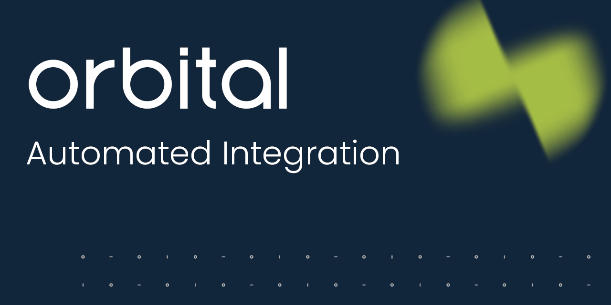
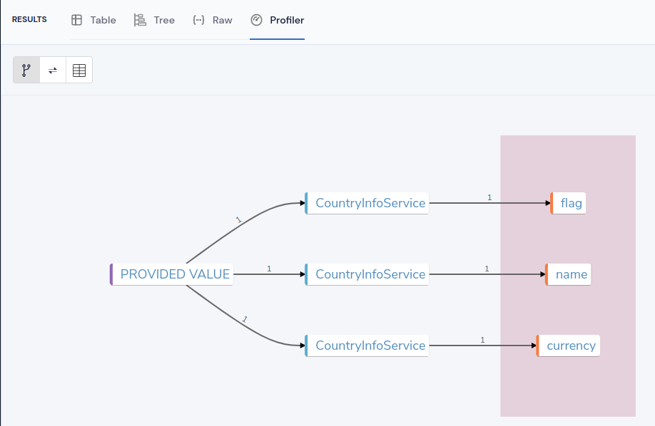
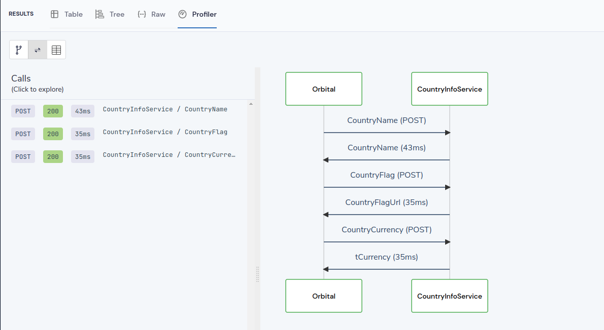
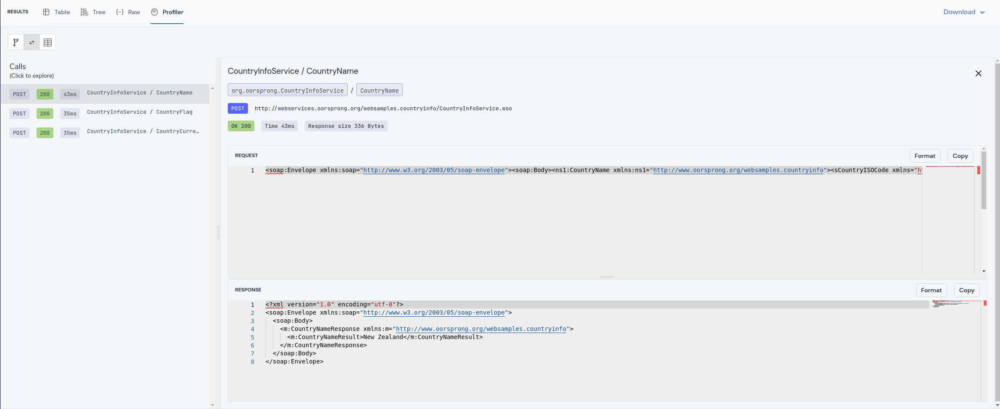

# Converting SOAP to JSON, and composing multiple requests into a single API

This demo focuses on:

 * Taking an old SOAP API
 * Reworking the endpoints to have smaller, more resource-oriented APIs
 * Publishing as RESTful JSON

After showing you the features of this demo, there's a short section breaking down exactly [how this all works](#how-this-all-works). 

This demo showcases the following Orbital features:

 * [Embedding Taxi within a SOAP WSDL](#embedding-taxi-in-soap)
 * [Exposing a TaxiQL query as an HTTP endpoint](#exposing-a-taxiql-query-as-an-api)

If you like this demo, please [Give us a Star](https://github.com/orbitalapi/orbital) on Github!

## Running this demo
 
1. Clone this repo, and cd into this directory

2. Run the following docker command to start Orbital, preconfigured with this project:

```bash
docker compose up -d 
```

## Things to try
After 20 seconds or so, open https://localhost:9022, and you should see Orbital's UI.

### Combining SOAP requests - Querying in the UI
Head to the [Query Editor](http://localhost:9022/query/editor) and paste the following query:

```taxi
import com.orbitalhq.CurrencyName
import com.orbitalhq.CountryFlagUrl
import com.orbitalhq.CountryName

given { iso: IsoCountryCode = "NZ"}
find { 
    name: CountryName
    flag: CountryFlagUrl
    currency: CurrencyName
 }
```

Click Run, and the query will execute. In the Results panel, on the Raw tab, you should see the following results:

```json
{
   "name": "New Zealand",
   "flag": "http://www.oorsprong.org/WebSamples.CountryInfo/Flags/New_Zealand.jpg",
   "currency": "New Zealand Dollars"
}
```

Click on the Profiler to see lineage of the query:



Clicking in the second tab shows the sequence diagram of calls:



Clicking on any of the calls lets you drill into the actual traffic, and see the request / response payload.



### Combining SOAP Requests - as an HTTP request

Try opening a browser (or Postman) and sending requesting this url:

http://localhost:9022/api/q/countrydata/NZ

You'll get the following JSON back:

```json
[
  {
    "name": "New Zealand",
    "flag": "http://www.oorsprong.org/WebSamples.CountryInfo/Flags/New_Zealand.jpg",
    "currency": "New Zealand Dollars",
    "capital": "Wellington"
  }
]
```

This works because we have the following Taxi saved query defined in `CountryData.query.taxi`:

```taxi
@HttpOperation(url = '/api/q/countrydata/{countryCode}', method = 'GET')
query countrydata(@PathVariable("countryCode") countryCode :  IsoCountryCode) {
   given { countryCode }
   find {
       name : CountryName
       flag: CountryFlagUrl
       currency: CurrencyName
       capital: CapitalCityName
   }
}
```

## How this all works
Everything starts with our Docker Compose file, and the taxi project.

### Things of note in the docker-compose file
Our `docker-compose.yml` is pretty standard, containing:
 * [Orbital](https://hub.docker.com/r/orbitalhq/orbital)
 * [Postgres](https://hub.docker.com/_/postgres)

Orbital is actually stateless when executing queries (which means is scales well),
but uses a database for things like History and Profiling.

There's also the following config, which is annotated

```yaml
OPTIONS: >-
   ## Capture the actual responses from remote calls, useful for debugging
   --vyne.analytics.persistRemoteCallResponses=true
   ## Capture the results of queries, useful for debugging.
   --vyne.analytics.persistResults=true
   ## Database connection options
   --vyne.db.username=orbital
   --vyne.db.password=changeme
   --vyne.db.host=postgres

   ## Load the workspace.conf file in this repository
   --vyne.workspace.config-file=/opt/service/workspace/workspace.conf
```

### Our Taxi project
Orbital is using a [taxi](https://taxilang.org) project which adds [semantic metadata](https://orbitalhq.com/blog/2023-05-22-semantic-metadata-101)
to our [SOAP WSDL](#embedding-taxi-in-soap).

Taxi metadata assigns tags to fields, so we can understand how data relates.  Once that's present, Orbital
can use the WSDL to call the required SOAP services we need, based on the data we ask for.

Our Taxi file in `taxi/src/CountryInfoDefinitions.taxi` defines a few simple tags:

```taxi
namespace com.orbitalhq 

type CurrencyIsoCode inherits String
type CurrencyName inherits String
```

These get embedded in our WSDL, and then used later when we write a query

### Embedding Taxi in Soap
Taxi can be embedded directly into SOAP WSDLs, to declare the semantic meaning of each field:

For example:

```taxi
   <xs:complexType name="tCurrency">
      <xs:sequence>
         <xs:element name="sISOCode" type="xs:string" 
>              taxi:type="com.orbitalhq.CurrencyIsoCode"/>
         <xs:element name="sName" type="xs:string" 
>              taxi:type="com.orbitalhq.CurrencyName"/>
      </xs:sequence>
   </xs:complexType>
```

See the actual annotated SOAP WSDL in [CountryInfoServiceSpec.wsdl](/wsdl/CountryInfoServiceSpec.wsdl).

Read more about this in the [docs](https://orbitalhq.com/docs/describing-data-sources/soap)

### Querying for data
Once the WSDL is annotated with our Taxi metadata, we can use it to write a query, as we saw when we [queried from the ui](#combining-soap-requests---querying-in-the-ui).

```taxi
given { iso: IsoCountryCode = "NZ"}
find { 
    // Each field comes from a different SOAP service.
    // But taxi keeps this nice and succinct, composing the services
    // together we need on demand
    name: CountryName
    flag: CountryFlagUrl
    currency: CurrencyName
 }
```

Try adding the `captial city` to the request.  Open the profiler, and you'll see an additional
request to another SOAP endpoint to grab the data:

```diff
import com.orbitalhq.CurrencyName
import com.orbitalhq.CountryFlagUrl
import com.orbitalhq.CountryName

given { iso: IsoCountryCode = "NZ"}
find { 
    name: CountryName
    flag: CountryFlagUrl
    currency: CurrencyName
+    captial: CapitalCityName
 }
```

### Exposing a TaxiQL query as an API
This project exposes a query that combines multiple SOAP operations together: 

```taxi
@HttpOperation(url = '/api/q/countrydata/{countryCode}', method = 'GET')
query countrydata(@PathVariable("countryCode") countryCode :  IsoCountryCode) {
   given { countryCode }
   find {
       name : CountryName
       flag: CountryFlagUrl
       currency: CurrencyName
       capital: CapitalCityName
   }
}
```

This query is available at `http://localhost:9022/api/q/countrydata/NZ` or `http://localhost:9022/api/q/countrydata/AUD` (or whatever country code interests you)

What's more, there's even a OpenAPI spec that's been automatically generated for us, available at http://localhost:9022/api/q/meta/countrydata/oas

Read more about Orbital creating OpenAPI specs in the [docs](https://orbitalhq.com/docs/querying/queries-as-endpoints#open-api).

## Summary
Orbital is combining multiple SOAP requests together for us, and packaging them together as a simple REST API.

There's no code involved, just a little sprinkle of semantic metadata!

This is only scratching the surface of what we can do.  Orbital can also stitch this data together with other APIs (such as [REST](https://orbitalhq.com/docs/describing-data-sources/open-api) / [gRPC](https://orbitalhq.com/docs/describing-data-sources/protobuf)), call [serverless functions](https://orbitalhq.com/docs/describing-data-sources/aws-services#lambda), query our [Databases](https://orbitalhq.com/docs/describing-data-sources/databases), or [Kafka queues](https://orbitalhq.com/docs/describing-data-sources/connect-kafka-topic).

If you liked this demo, remember to [Star our Github Repo](https://github/orbitalapi/orbital), and [get started](https://oribtalhq.com/docs) with Orbital now.

